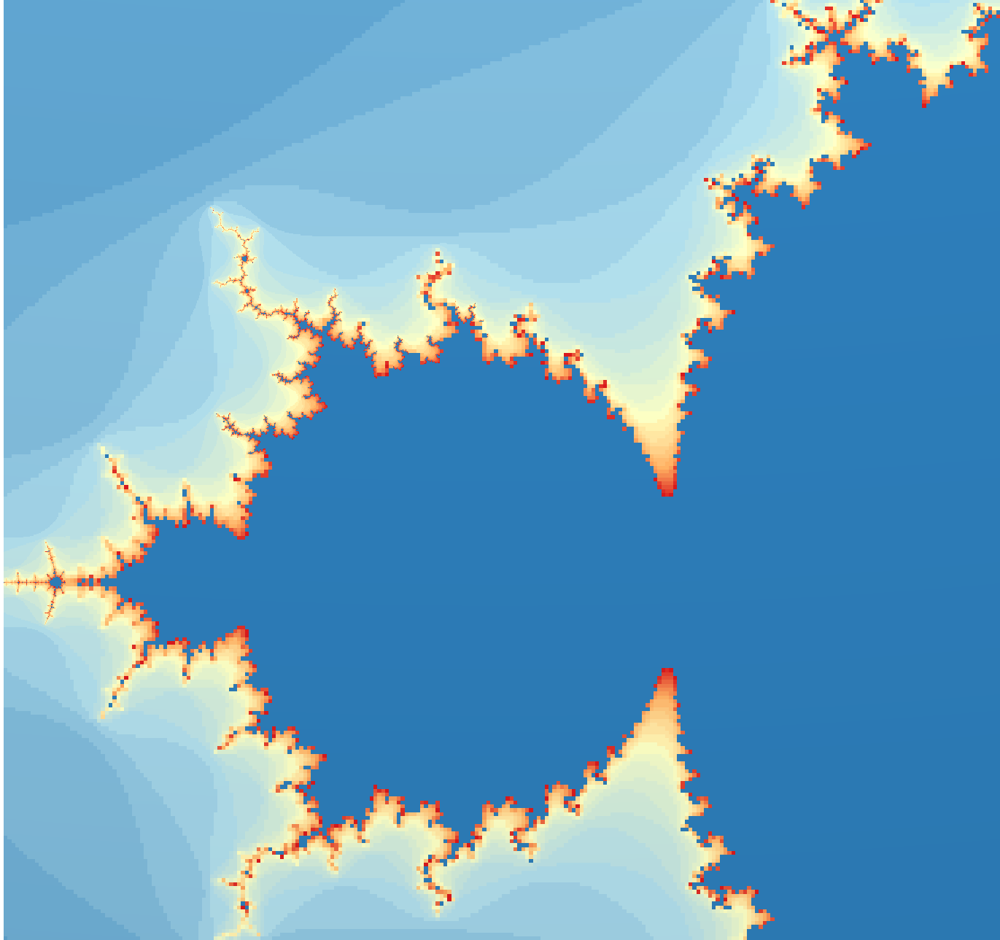

# LibSimController
acquire data from LibSim instrumented simulations

## Purpose

Retrieve simulation data during the runtime of LibSim instrumented simulations.

## Data Preparation
The LibSim instrumented simulation must initialize MPI with MPI_Init_thread and thread support MPI_THREAD_MULTIPLE.

## Ports


<svg width="102.8em" height="4.6em" >
<style>.text { font: normal 1.0em sans-serif;}tspan{ font: italic 1.0em sans-serif;}.moduleName{ font: bold 1.0em sans-serif;}</style>
<rect x="0em" y="0.8em" width="10.28em" height="3.0em" rx="0.1em" ry="0.1em" style="fill:#64c8c8ff;" />
<text x="0.2em" y="2.6500000000000004em" class="moduleName" >LibSimController</text></svg>

Ports are dynamically created depending on the data the simulation provides. Data for unconnected ports
is not requested from LibSim.


## Parameters
|name|description|type|
|-|-|-|
|path|path to a .sim2 file or directory containing these files|String|
|simulation_name|the name of the simulation as used in the filename of the sim2 file |String|
|vtk_variables|sort the variable data on the grid from VTK ordering to Vistles|Int|
|constant_grids|are the grids the same for every timestep?|Int|
|frequency|frequency in which data is retrieved from the simulation|Int|
|combine_grids|combine all structure grids on a rank to a single unstructured grid|Int|
|keep_timesteps|keep data of processed timestep of this execution|Int|

Depending on the connected ports and the frequency parameter the module requests data from the simulation.
Once the simulation generates the requested data the module is automatically executed.

### Simulation Specific Commands
Connected simulations might provide additional commands that are (for now) represented by parameters. Changing one of these parameters triggers the displayed action in the simulation, while the actual value of bolean parameters is meaningless the simulation can also specify commands that take a string as argument. These commands are represented as string input parameters
and send their string value to the simulation on change.

## Usage Examples

### Mandelbrot example
-Download the [Mandelbrot simulation](https://www.visitusers.org/index.php?title=VisIt-tutorial-in-situ#Resources) and edit the Makefile as described. Additionally set "CXX=mpic++" and add -DPARALLEL to CXXFLAGS  
-Open mandelbrot.C and change:
```cpp
    /* Initialize MPI */
    MPI_Init(&argc, &argv);
``` 
to
```cpp
    /* Initialize MPI */
    int provided = MPI_THREAD_SINGLE;
    MPI_Init_thread(&argc, &argv, MPI_THREAD_MULTIPLE, &provided);
``` 
#### For multi process Vistle:
-build and run the simulation. 
```bash
make
export LD_LIBRARY_PATH=~/src/vistle/build/lib"
mpirun -np 2 ./mandelbrot
```

-start vistle in a new terminal
```bash
export MPISIZE=2
vistle
``` 
-start the LibSimController module and set the path parameter to the LibSim file.   
The default location for these files is:  
$HOME/.visit/simulations/*hash*.mandelbrot_par.sim2.  

#### For single process Vistle:
-build and run the simulation. 
```bash
make
export VISTLE_ROOT=~/src/vistle/build/
export LD_LIBRARY_PATH=$VISTLE_ROOT/lib"
#to use COVER
export LD_LIBRARY_PATH=$LD_LIBRARY_PATH:~/src/covise/archsuffix/lib"
export COVISEDIR=$HOME/src/covise
export COVISE_PATH=$VISTLE_ROOT:$COVISEDIR


mpirun -np 2 ./mandelbrot
```

-start vistle hub in a new terminal with the LibSim start option and the path to the sim2 file
```bash
export MPISIZE=2
vistle -l $HOME/.visit/simulations/hash.mandelbrot_par.sim2
``` 
-start the LibSimController module
#### For both versions:

The module should now display two output ports: AMR mesh and mandelbrot.  
-enable VTK variables for the LibSimController module  
-connect the mandelbrot port with the following modues as shown in the picture:


-enable quad for Domainsurface  
-pres step in the LibSimController module to execute one timestep or type *step* in the commandline of the simulation
-in COVER *view all* and rotate the image. Use *Navigation/Center view* to allign the image. The rusult should look like:



## Related Modules
SenseiController

## Acknowledgements
Developed through funding from the EXCELLERAT centre of excellence.
