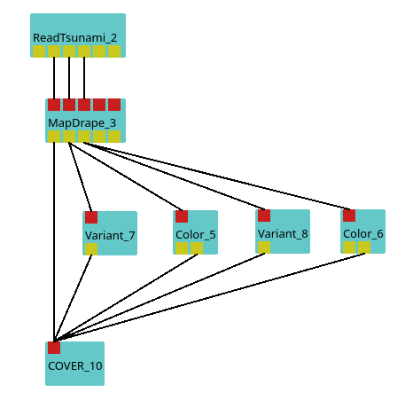

[headline]:<>

## Purpose

This module is designed to read [TsunamiHySEA](https://edanya.uma.es/hysea/index.php/models/tsunami-hysea) files. [TsunamiHySEA](https://edanya.uma.es/hysea/index.php/models/tsunami-hysea) is a numerical model for quake generated tsunami simulation. The raw data output of the simulation is a netCDF file which contains the following mandatory attributes:

- **lon**: Longitude array which specifies one dimension of the sea domain

- **lat**: Latitdude array which specifies one dimension of the sea domain

- **grid_lat**: Latitdude array of the topography

- **grid_lon**: Longitude array of the topography

- **time**: Timesteps used for the simulation

- **eta**: Wave amplitude per timestep

## How the reader works

The reader is able to read netCDF files which uses a [PnetCDF](https://parallel-netcdf.github.io/) supported file type. In general the module will fetch the longitude and latitude values for the sea (**lon**, **lat**) and the batheymetry (**grid_lon**, **grid_lat**) from the netCDF file. Based on each longitude-latitude pair the reader creates a 2D grid, varies the wave height (**eta** - orthogonal to longitude and latitude coordinates) per timestep and creates a 3D surface representing the sea surface out of it. If an attribute **bathymetry** is provided with the netCDF file the reader will build a ground surface as well. Additional attributes like scalar data will be mapped onto the sea surface.

---

## Ports
[moduleHtml]:<>

The first two ports output the geometry for the sea surface and bathymetry as an LayerGrid/Heightmap object. The other ports are providing a vistle scalar object which representing the corresponding in the parameter browser selected attributes.

[parameters]:<>

This module distributes the data into domain blocks per spawned mpi process. With the parameters **blocks latitude** and **blocks longitude** an user needs to specify the distribution of the simulation domain. The parameter **fill** enables the option to replace in the netCDF file used fillValues for the attribute **eta** with a new fillValue to reduce the height dimension of the sea surface. If **fill** is enabled an user need to specify the current fillValue with the parameter **fillValue** (default fillValue: -9999) along with the replacement with **fillValueNew**. A netCDF file read by this reader which does not contain a bathymetry attribute named with a string containing atleast the substring *"bathy"* won't get noticed as bathymetry data and therefore not providing output data for the second port. In this case the parameter browser will show **None** for the parameter **bathymetry**. Otherwise there will be a selection of bathymetry options available.

## Example Usage

## Build Requirements

- PnetCDF: build with --enable-thread-safe flag as described on [PnetCDF-GitHub](https://github.com/Parallel-NetCDF/PnetCDF) or installed via packagemanager

:::{note}
The pnetcdf install directory should be added to your $PATH environment variable in order to be found by CMake, otherwise it won't be build.
:::

## Acknowledgements

- [TsunamiHySEA](https://github.com/edanya-uma/TsunamiHySEA)
- [ChEESE](https://cheese-coe.eu/)
