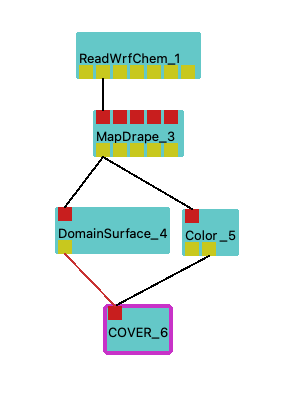

[headline]:<>

## Purpose
This module can be used to import data from NetCDF files generated by [WRF-Chem](https://ruc.noaa.gov/wrf/wrf-chem/) simulations.

## Data Preparation 
Files must be in NetCDF format (type classic or 64-bit offset).

The underlying data structure is assumed to be a structured grid.

For dynamic data, data for each timestep must be present in a separate file. 

## Ports
[moduleHtml]:<>

[parameters]:<>

### Required parameters
File must provide at least the following variables:

- **file_dir** : Path to directory containing NetCDF file(s).
- **GridX**, **GridY**: lateral coordinates (typically latitude and longitude) of each vertex

Also either of the following is necessary: 
- **GridZ** : elevation (in meters) of vertex
- **pert gp** and **base gp**: geopotential to be used for computation of altitude of vertices 

### Important Optional Parameters
The remaining parameters might be changed/selected as needed:
- **var dim**: choose dimension of variables
- **Variable0-2**: scalar data (given on the grids vertices)

## Usage Examples

## Related Modules
### Often Used With
ReadWrfChem is typically followed by:
- MapDrape

## Build Requirements
This module requires the [NetCDF C++](https://www.unidata.ucar.edu/software/netcdf/) library.

## Acknowledgements 
This module was developed within the EU-funded project [Open Forecast](https://open-forecast.eu)
