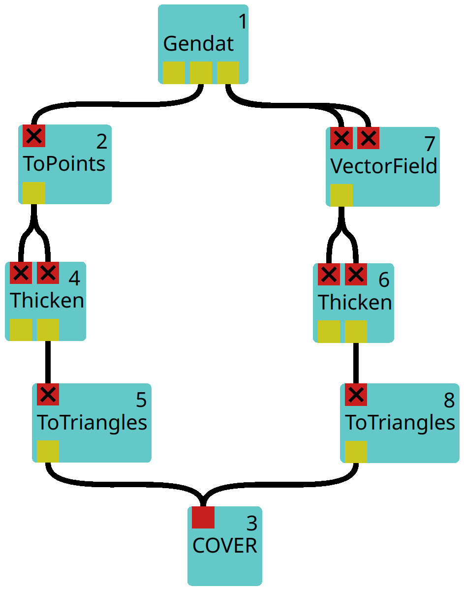

[headline]:<>

## Purpose

The **Thicken** module can be used to expand lines into tubes or points into spheres. The radius of the resulting tube/sphere can be set to a fixed value or be dependent of a given scalar value.

## Ports
[moduleHtml]:<>

The first input port `grid_in` is required and expects lines or points which the module will expand to tubes or spheres. The module automatically detects whether lines or spheres are provided.
    The second input port `data_in` is optional and takes a data field that can be used to calculate the radii of these tubes/spheres.

[parameters]:<>

There are different modes for setting the radius of the resulting geometric bodies which can be selected with `map_mode` in the parameter window. Additionally, the `radius` and `sphere scale` parameters can be altered, to fine-tune the resulting radius and a `range` can be given for clipping the values of the radii.

### Map modes:
- **DoNothing:** Does not change the geometry. However, if `data_in` is not empty, the mapped data is added to `grid_in` and returned through the `data_out` port.
- **Fixed:** Sets the radius to `radius`. If the input grid is a spheres object, it additionally multiplies the value `sphere scale` to the radius. We will refer to this value as *Fixed-scale* in the following.
- **Radius or InvRadius**: Maps the data values (or its reciprocal, respectively) provided through `data_in` (multiplied with *Fixed-scale*) to the radii of each data point/line. If the data is three-dimensional, the L2-norm is calculated.
- **Surface or InvSurface**: Like **Radius or InvRadius**, respectively, but before **Fixed-Scale** is multiplied to the radius, the square root of the values in `data_in`is calculated.
- **Volume or InvVolume**: Like **Surface or InvSurface**, respectively, but instead of the square root, the cube root is calculated.

## Usage Examples

<figure float="left">
    
    
    <figcaption>Fig.1. Example workflow using Thicken (left) and step-by-step results (right). On the top-right, a scalar data set is shown as points which can only be seen by zooming in considerably. In the center, the same data set is shown as spheres. At the bottom, the vector field has been added, after expanding its lines into tubes.</figcaption>
</figure>

In this example, the scalar data field of a data set is first transformed into points via [ToPoints](ToPoints.md) (see top-right image) and then thickened into spheres (see image in the center of the right image). The radii of the spheres depend on the scalar data field.
**Note:** To avoid rendering errors, it is important to pass the output to the [ToTriangles](ToTriangles.md) module whose `transform spheres` parameter has been **enabled**.

Moreover, three-dimensional input data is transformed into a vector field through the [VectorField](VectorField.md) module and the resulting lines are expanded into tubes (see bottom of the right image).

## Related Modules

### Often Used With

- [ToTriangles](ToTriangles.md)
- [ToPoints](ToPoints.md)
- [VectorField](VectorField.md)
