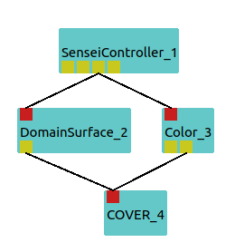

[headline]:<>
## Purpose
This module is used to connect to a simulation via the SENSEI in-situ interface.


## Data Preparation
[SENSEI](https://github.com/hpcdgrie/sensei) has to be build and configured to use Vistle as a back-end.
This can be done through using the VistleAnalysisAdapter directly or through the ConfigurableAnalysisAdaptor
by specifing:
```xml
  <analysis type="vistle"
            frequency="1"
            mode="interactive,paused"
            enabled="1"
            options=""/>
            <!-- options="-c localhost:31095"/-->

``` 
in the xml file that is passed to the SENSEI ConfigurableAnalysisAdaptor. Via the options tag additional command line parameters can be passed to vistle. 

## Ports

[moduleHtml]:<>

Ports are dynamically created depending on the data the simulation provides. Data for unconnected ports
is not processed by SENSEI and not passed to Vistle.

[parameters]:<>

Depending on the connected ports and the frequency parameter the module requests data from the simulation.
Once the simulation generates the requested data the module is automatically executed.

### Simulation Specific Commands
Connected simulations might provide additional commands that are (for now) represented by parameters. Changing one of these parameters triggers the displayed action in the simulation, the actual value of these parameters is meaningless.

### Oscillator Example 
- checkout git@github.com:hpcdgrie/sensei.git and build SENSEI with the ENABLE_VISTLE CMake flag

-for single process Vistle: export Vistle environment:
```xml
export VISTLE_ROOT=~/src/vistle/build/
export LD_LIBRARY_PATH=$VISTLE_ROOT/lib"
#to use COVER
export LD_LIBRARY_PATH=$LD_LIBRARY_PATH:~/src/covise/archsuffix/lib"
export COVISEDIR=$HOME/src/covise
export COVISE_PATH=$VISTLE_ROOT:$COVISEDIR
```

- start the simulation: *path to SENSEI build*/bin/oscillator -f ../../configs/oscillatorVistle.xml ../../miniapps/oscillators/inputs/sample.osc

-start vistle or, for single process Vistle, start vistle_gui and connect it to the simulation's hub
-load oscillatorExample.vsl



- click on the run/paused parameter of this module to start/pause the simulation. The results should look like the following image:


## Related Modules
LibSimController

## Build Requirements
Same version of VTK required as used in SENSEI.


## Acknowledgements
Developed through funding from the EXCELLERAT centre of excellence.